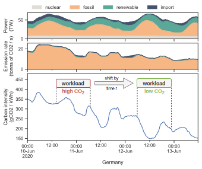

# Let's Wait Awhile - Datasets, Simulator, Analysis



This repository contains datasets, simulation code, and analysis notebooks used in the paper "Let's Wait Awhile: How Temporal Workload Shifting Can Reduce Carbon Emissions in the Cloud":

- `data/*`: Energy production and carbon intensity datasets for the regions Germany, Great Britain, France (all via the [ENTSO-E Transparency Platform](https://transparency.entsoe.eu/)) and California (via [California ISO](https://www.caiso.com/)) for the entire year 2020 +-10 days.
- `compute_carbon_intensity.py`: The script used to convert energy production to carbon intensity data using energy source carbon intensity values provided by an [IPCC study](http://www.ipcc-wg3.de/report/IPCC_SRREN_Annex_II.pdf).
- `simulate.py`: A simulator to experimentally evaluate temporal workload shifting approaches in data centers with the goal to consume low-carbon energy.
- `analysis.ipynb`: Notebook used to analyze the carbon intensity data.
- `evaluation.ipynb`: Notebook used to analyze the simulation results.

For executing the code you need to install the libraries listed in `environment.yml`, e.g. by using a [conda environment](https://conda.io/).


## Publications

If you use any datasets or code from this repository, please reference our publication:

- Philipp Wiesner, Ilja Behnke, Dominik Scheinert,  Kordian Gontarska, and Lauritz Thamsen. "Let's Wait Awhile: How Temporal Workload Shifting Can Reduce Carbon Emissions in the Cloud" In the Proceedings of the *22nd International Middleware Conference*, ACM, 2021.

BibTeX:
```
@inproceedings{Wiesner_LetsWaitAwhile_2021,
  author={Wiesner, Philipp and Behnke, Ilja and Scheinert, Dominik and Gontarska, Kordian and Thamsen, Lauritz},
  booktitle={Middleware'21: 22nd International Middleware Conference}, 
  title={Let's Wait Awhile: How Temporal Workload Shifting Can Reduce Carbon Emissions in the Cloud}, 
  publisher = {{ACM}},
  year={2021},
  doi={10.1145/3464298.3493399}
}
```
